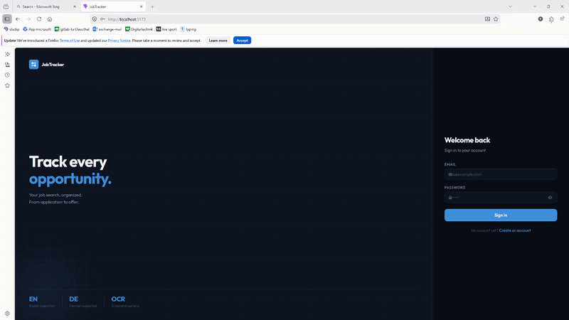
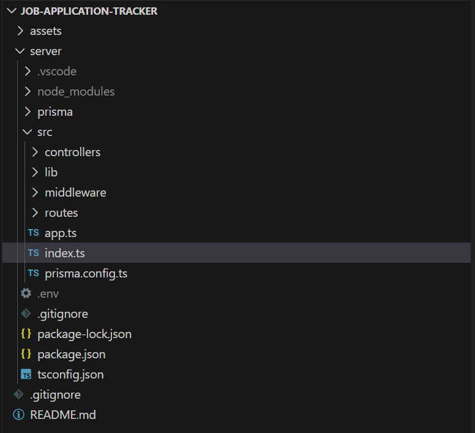

# Job Application Tracker — Smart Job Parsing (EN / DE)

A full-stack web application that helps users track their job applications and automatically extract key information from job postings written in **English** or **German**, either from **text** or **screenshots**.

This project focuses on clean backend architecture, real-world business logic, and progressive feature development.

---

## Demo

 
---

## Overview

Managing job applications across multiple platforms can quickly become chaotic.  
This application centralizes the process by allowing users to:

- track job applications manually
- **automatically extract structured data from job postings**
- manage applications through a clean and secure system

The application is designed with a **client–server architecture** and follows REST API best practices.

---

## Key Features

- User authentication (register / login)
- Manual job application tracking
- **Smart job parsing from copied job descriptions**
- **Job parsing from screenshots (OCR)**
- Automatic extraction of:
  - Job title
  - Company name
  - Contract type (Vollzeit, Teilzeit, Minijob, Praktikum, etc.)
  - Salary (hourly or yearly, if mentioned)
  - Location (city)
  - Work mode (on-site, hybrid, remote)
- Automatic application date assignment
- User-owned job applications (secure & isolated)

---

## Supported Inputs

- Copy-paste job posting text
- Screenshot image upload (PNG / JPG)

> Images are converted to text using OCR before processing.

---

## Supported Languages

- English 🇬🇧
- German 🇩🇪

> Other languages are not supported in the current version.

---

## Application Workflow

1. User registers or logs in
2. User submits:
   - a job description text  
   **or**
   - a screenshot of a job posting
3. Backend processes the input:
   - OCR (if image)
   - text analysis & extraction
4. Structured job data is generated automatically
5. User reviews and optionally edits the extracted fields
6. Job application is saved with the current date
7. User tracks application status in the dashboard

---

## Architecture

The application follows a **client–server architecture**:

- **Frontend (Client)**  
  Handles user interaction, forms, and API communication

- **Backend (Server)**  
  Exposes a REST API, applies business logic, and manages authentication

- **Database**  
  Stores users, job applications, and relationships

---

## Built Using

### Front-end

- [React](https://react.dev/) — Frontend framework for building user interfaces
- [TypeScript](https://www.typescriptlang.org/) — Typed JavaScript for safer and more maintainable code
- [React Router](https://reactrouter.com/) — Client-side routing and navigation
- [CSS](https://developer.mozilla.org/en-US/docs/Web/CSS) — Styling and layout
- [Fetch API](https://developer.mozilla.org/en-US/docs/Web/API/Fetch_API) — HTTP communication with the backend

---

### Back-end

- [Node.js](https://nodejs.org/) — JavaScript runtime environment
- [Express](https://expressjs.com/) — Web framework for building REST APIs
- [Prisma](https://www.prisma.io/) — ORM for type-safe database access
- [PostgreSQL](https://www.postgresql.org/) — Relational database for persistent storage
- [JWT (JSON Web Token)](https://jwt.io/) — Secure authentication mechanism
- [bcrypt](https://www.npmjs.com/package/bcrypt) — Password hashing
- [dotenv](https://www.npmjs.com/package/dotenv) — Environment variable management

---

### Image & Text Processing

- OCR (planned) — Image-to-text extraction for job screenshots
- Custom text parsing — Rule-based extraction for EN / DE job postings

## Project Structure

Below is a snapshot of the current project structure in VS Code:

